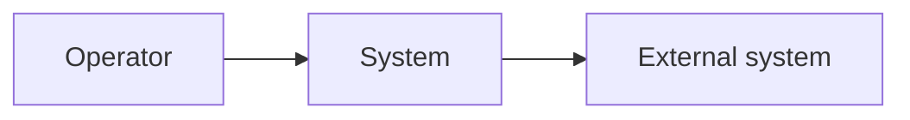
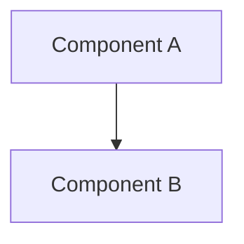

# [Product Name]: Architecture Baseline

**Source Requirements**: [Relative link to approved product requirements]
**Source Roadmap**: [Relative link to approved feature roadmap]
**Constitution**: [Relative link, or Not present]
**Mode**: full
**Status**: Draft | Ready for Review | Approved
**Last Updated**: YYYY-MM-DD
**Approved By**: Not approved | [Name or role]
**Approval Evidence**: Not approved | [Explicit user statement or review reference]

This document owns technical decisions that more than one feature depends on.
Decisions inside a single feature belong to that feature's `plan.md`. A
`plan.md` may refine this baseline and may not contradict it.

## Technical Drivers

Every driver cites the requirement that creates it. A quality attribute with no
requirement behind it is not a driver.

| Driver | Source | Consequence |
|--------|--------|-------------|
| [Approved quality or business driver] | PR-0XX | [Constraint forced by that source] |
| [Approved safeguard] | PR-100 | [Observable architecture consequence] |

## System Context

| External dependency | Direction | Protocol | Owned by | Failure behavior |
|---------------------|-----------|----------|----------|------------------|
| [Named external system, if any] | [Direction] | [Approved protocol or TBD] | [Owner] | [Required failure behavior] |

## Components

| Component | Responsibility | Owns data | Deployed as |
|-----------|----------------|-----------|-------------|
| [Name] | [One sentence] | [Yes/No, which] | [Process or unit] |

## Technology Decisions

| Area | Choice | Rationale | Door | ADR |
|------|--------|-----------|------|-----|
| Language and runtime | [Choice] | [Driver or constraint] | one-way | ADR-0001 |
| Web framework | [Choice] | [Reason] | two-way | — |
| Datastore | [Choice] | [Driver] | one-way | ADR-0002 |
| Migrations | [Choice] | [Reason] | two-way | — |
| AuthN / AuthZ | [Choice] | [Driver] | one-way | ADR-0003 |
| Background work | [Choice] | [Reason] | two-way | — |
| Observability | [Choice] | [Reason] | two-way | — |
| Packaging and deployment | [Choice] | [Constraint] | one-way | ADR-0004 |

Delete rows that are not forced by approved drivers; never choose a technology
only to complete this table.

`Door` is one-way when reversal means rewriting shipped features, migrating
data, or breaking an external contract. Every one-way decision has an ADR.

## Cross-Cutting Strategies

State each as a rule a reviewer can check a `plan.md` against.

| Concern | Strategy |
|---------|----------|
| Persistence and transactions | [Boundary and consistency rule] |
| Connectivity / synchronization, if required | [Availability and conflict rule, or Not applicable with source] |
| Error taxonomy | [Categories, and what each does at the boundary] |
| Retry and idempotency | [Which operations, which key] |
| Authorization | [Where checks live, what they check] |
| Configuration and secrets | [Where they come from, what is never committed] |
| Logging and tracing | [What every request emits] |
| Testing | [Required layers and what each proves] |

## Boundaries and Dependency Rules

- [e.g. Domain code MUST NOT import framework or transport types]
- [e.g. A feature MUST NOT read another feature's tables directly]
- [e.g. All external calls go through an adapter in the integration layer]

## Plan Constraints

The block every feature `plan.md` must honor. Keep it short, testable, and free
of rationale — rationale lives above and in the ADRs.

- **AC-001**: [Constraint]
- **AC-002**: [Constraint]
- **AC-003**: [Constraint]

## Deferred Decisions

| # | Undecided | Why not now | Trigger | Keep the option open by |
|---|-----------|-------------|---------|-------------------------|
| D-1 | [Decision] | [Missing evidence] | [Feature or scale point] | [What code must avoid doing] |

## Spikes

| # | Question | Time box | Blocks | Output |
|---|----------|----------|--------|--------|
| S-1 | [Question an answer would settle] | [e.g. 2 days] | [FNNN] | Throwaway; result recorded as ADR |

## Technical Risks

| Risk | Impact | Early signal | Response |
|------|--------|--------------|----------|
| [Risk] | [What breaks] | [What you would observe first] | [Mitigation or accepted] |

## Non-Goals

- [Technical capability deliberately not built, and what would change that]

## Decision Log

| ADR | Title | Status |
|-----|-------|--------|
| ADR-0001 | [Title] | Ready for Review |
