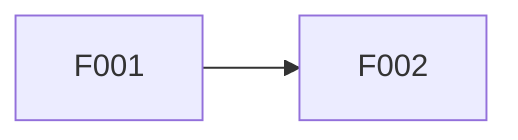

# [Product Name]: Feature Roadmap

**Source Requirements**: [Relative link to approved product requirements]
**Status**: Draft | Ready for Review | Approved
**Artifact bundle**: split
**Last Updated**: YYYY-MM-DD
**Approved By**: Not approved | [Name or role]
**Approval Evidence**: Not approved | [Explicit user statement or review reference]
**Profile sizing**: full | lite
**Feature count**: [positive integer]
**Deployable count**: [positive integer]
**Datastore count**: [non-negative integer]
**Owning team count**: [positive integer]
**Regulatory/audit/contractual constraint**: yes | no | unknown
**Sizing evidence**: [Stable source anchor(s) only]

## Delivery Strategy

[How the sequence reaches a usable release while controlling product risk.]

## Ownership Boundary

This root owns feature routing, requirement ownership/coverage, dependencies and
order, horizon, UI surface, and release boundary. Domain members own outcomes,
scope, non-goals, risk, independent acceptance, and handoff names. Product truth
must appear under exactly one owner.

## Domain Registry

| Domain key | Detail path | Feature IDs |
|---|---|---|
| [stable-domain-key] | `{{DOMAIN_1_PATH}}` | F001, F002 |

## Feature Control Registry

| Feature | Domain | Horizon | UI Surface | Dependencies | Release Boundary |
|---|---|---|---|---|---|
| F001 | [stable-domain-key] | Committed | new screens | None | MVP |
| F002 | [stable-domain-key] | Planned | reuses existing | F001 | Post-MVP |

Allowed horizons: `Committed`, `Planned`, `Candidate`, `Unknown`.
Allowed UI surfaces: `none`, `reuses existing`, `new screens`.

## Dependency and Order Graph

## Requirements Coverage

| Requirement | Relationship | Feature(s) | Status |
|---|---|---|---|
| PR-001 | Owns | F001 | Covered |
| PR-100 | Applies | F001, F002 | Covered |

## Validation Findings

- **Uncovered requirements**: None
- **Duplicate ownership**: None
- **Circular dependencies**: None
- **Boundary concerns**: None

## Member Registry

The complete set of external files owned by this root. List each member exactly
once; do not list this root or cited source artifacts. No hashes are recorded —
Git detects member drift.

| Path | Owns |
|---|---|
| `{{DOMAIN_1_PATH}}` | `{{DOMAIN_1_SCOPE}}` |
