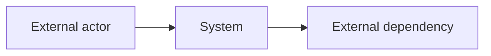

# [Product Name]: Architecture Baseline

**Source Requirements**: [Relative link to approved product requirements]
**Source Roadmap**: [Relative link to approved feature roadmap]
**Constitution**: [Relative link, or Not present]
**Mode**: full
**Status**: Draft | Ready for Review | Approved
**Artifact bundle**: split
**Last Updated**: YYYY-MM-DD
**Approved By**: Not approved | [Name or role]
**Approval Evidence**: Not approved | [Explicit user statement or review reference]

This root owns cross-domain drivers, boundaries, constraints, and member
routing. Domain members own domain-scoped decision text; ADRs own rationale and
history.

## Technical Drivers

| Driver | Source | Consequence |
|---|---|---|
| [Approved cross-domain driver] | PR-0XX | [Constraint forced by it] |

## System Context and Boundaries

- [Testable cross-domain boundary or dependency rule]

## Cross-Domain Strategies

| Concern | Strategy | Source |
|---|---|---|
| [Cross-feature concern] | [Enforceable rule] | PR-0XX |

## Global Plan Constraints

- **AC-001**: [Testable constraint]

## Domain Detail Registry

| Domain key | Detail path | Owned decision/constraint IDs |
|---|---|---|
| [stable-domain-key] | `{{DOMAIN_1_PATH}}` | AD-001, AC-101 |

## Decision Record Registry

| ADR | Path |
|---|---|
| ADR-0001 | `{{ADR_0001_PATH}}` |

## Deferred Decisions and Spikes

| ID | Kind | Question or decision | Trigger/time box | Blocks |
|---|---|---|---|---|
| D-1 | Deferred | [Decision] | [Trigger] | F001 |
| SPK-001 | Spike | [Question an answer would settle] | [e.g. 2 days] | [Owning feature/work item] |

## Technical Risks

| Risk | Early signal | Response |
|---|---|---|
| [Risk] | [Observable signal] | [Mitigation or acceptance] |

## Member Registry

The complete set of domain-detail and ADR members owned by this root. List each
member exactly once; do not list this root or cited source artifacts. No hashes
are recorded — Git detects member drift.

| Path | Owns |
|---|---|
| `{{DOMAIN_1_PATH}}` | `{{DOMAIN_1_SCOPE}}` |
| `{{ADR_0001_PATH}}` | `{{ADR_0001_TITLE}}` |
