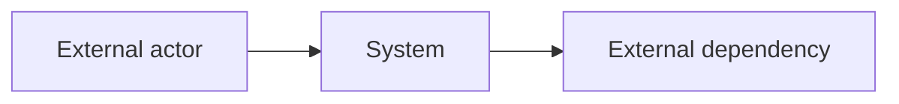
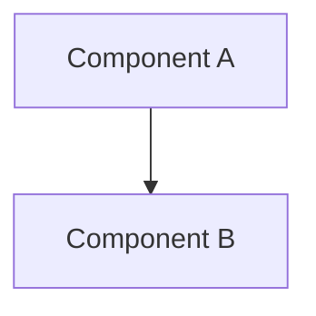

# [Product Name]: Architecture Baseline

**Source Requirements**: [Relative link to approved product requirements]
**Source Roadmap**: [Relative link to approved feature roadmap]
**Constitution**: [Relative link, or Not present]
**Mode**: full
**Status**: Draft | Ready for Review | Approved
**Artifact bundle**: single
**Last Updated**: YYYY-MM-DD
**Approved By**: Not approved | [Name or role]
**Approval Evidence**: Not approved | [Explicit user statement or review reference]

This document owns technical decisions that more than one feature depends on.
Decisions inside a single feature belong to that feature's `plan.md`. A
`plan.md` may refine this baseline and may not contradict it.

## Technical Drivers

Every driver cites the requirement that creates it. A quality attribute with no
requirement behind it is not a driver.

| Driver | Source | Consequence |
|--------|--------|-------------|
| [Approved quality or business driver] | PR-0XX | [Constraint forced by that source] |
| [Approved safeguard] | PR-100 | [Observable architecture consequence] |

## System Context

| External dependency | Direction | Protocol | Owned by | Failure behavior |
|---------------------|-----------|----------|----------|------------------|
| [Named external system, if any] | [Direction] | [Approved protocol or TBD] | [Owner] | [Required failure behavior] |

## Components

| Component | Responsibility | Owns data | Deployed as |
|-----------|----------------|-----------|-------------|
| [Name] | [One sentence] | [Yes/No, which] | [Process or unit] |

## Technology Decisions

| Area | Choice | Rationale | Door | ADR |
|------|--------|-----------|------|-----|
| [Decision area] | [Choice] | [Driver or constraint] | one-way | ADR-0001 |
| [Decision area] | [Choice] | [Reason] | two-way | Not required |

Delete rows that are not forced by approved drivers; never choose a technology
only to complete this table.

`Door` is one-way when reversal means rewriting shipped features, migrating
data, or breaking an external contract. Every one-way decision has an ADR.

## Cross-Cutting Strategies

State each as a rule a reviewer can check a `plan.md` against.

| Concern | Strategy |
|---------|----------|
| [Cross-feature concern] | [Requirement-backed rule] |

## Boundaries and Dependency Rules

- [Testable dependency or ownership rule]

## Plan Constraints

The block every feature `plan.md` must honor. Keep it short, testable, and free
of rationale — rationale lives above and in the ADRs.

- **AC-001**: [Constraint]
- **AC-002**: [Constraint]
- **AC-003**: [Constraint]

## Deferred Decisions

| # | Undecided | Why not now | Trigger | Keep the option open by |
|---|-----------|-------------|---------|-------------------------|
| D-1 | [Decision] | [Missing evidence] | [Feature or scale point] | [What code must avoid doing] |

## Spikes

| ID | Question | Time box | Blocks | Output |
|---|----------|----------|--------|--------|
| SPK-001 | [Question an answer would settle] | [e.g. 2 days] | [Owning feature/work item] | Disposable investigation; any architecture change requires a CR |

## Technical Risks

| Risk | Impact | Early signal | Response |
|------|--------|--------------|----------|
| [Risk] | [What breaks] | [What you would observe first] | [Mitigation or accepted] |
