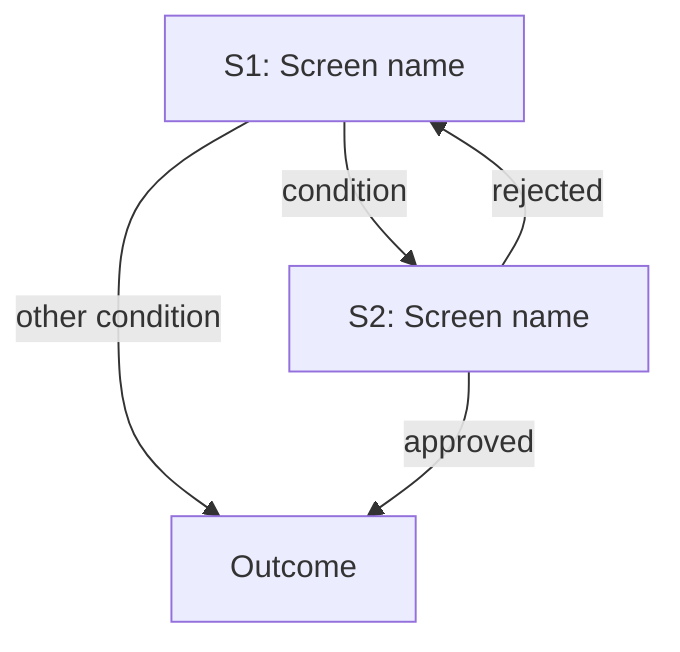

# [FNNN]: [Feature Name] — Wireframes

**Feature Spec**: [Relative link to spec.md]
**Roadmap Entry**: [Relative link and feature ID]
**UI Structure**: [Relative link to doc/ui-structure.md] | Not applicable — [approved rationale/source]
**UI Surface**: reuses existing | new screens
**Status**: Ready for Review
**Artifact bundle**: single
**Last Updated**: YYYY-MM-DD

Human approval is recorded by the lifecycle owner after review; generation of
this draft does not approve it.

Low-fidelity layout intent for this feature only. Produced after feature
clarification and before technical planning. Contains no component library,
styling, or framework decision.

## Screen Inventory

| # | Screen | Why it qualifies | Level |
|---|--------|------------------|-------|
| S1 | [Screen name] | New route | L1 + L2 |
| S2 | [Screen name] | Layout materially differs from S1 | L1 + L2 |

### Deliberately not drawn

| Element | Reason | Recorded in |
|---------|--------|-------------|
| [Context selector] | Single control, no navigation | S1 control table |
| [Delete confirmation] | Established pattern from UI structure | S1 state table |

## S1: [Screen Name]

**Context**: [Approved device, channel, or interaction context]
**Entered from**: [Screen or action]
**Serves**: [Acceptance scenarios or PR IDs]

```text
+--------------------------------------------------+
| [<]  {{ title }}                     [status]    |
+--------------------------------------------------+
|                                                  |
|  {{ content }}                                   |
|                                                  |
+--------------------------------------------------+
|            [ Cancel ]        [[ Confirm ]]       |
+--------------------------------------------------+
```

### Controls

| Control | Type | Options / source | Default | On interact | Disabled when |
|---------|------|------------------|---------|-------------|---------------|
| [Name] | [Approved interaction type] | [Where options come from, or N/A] | [Default] | [Effect] | [Condition] |

### States

| State | Trigger | Screen behavior | Next |
|-------|---------|-----------------|------|
| Initial | Screen entered | [What is focused, what is disabled] | [Wait for X] |
| Loading | [Trigger] | [Indicator, what stays interactive] | [Success or error] |
| Empty | [Trigger] | [Message and recovery action] | [Next] |
| Error | [Trigger] | [Blocking or non-blocking, message, recovery] | [Next] |
| Offline | [Trigger] | [Per UI structure offline pattern] | [Next] |
| Success | [Trigger] | [Feedback and destination] | [Next] |

Mark any state `N/A` with a reason rather than omitting it.

## S2: [Screen Name]

[Same structure as S1.]

## Flows

Only flows that span two or more screens and branch.

### FLOW-1: [Name]



| Edge | Condition | Product rule |
|------|-----------|--------------|
| S1 → S2 | [Named condition] | PR-### |

## Deviations from UI Structure

| Deviation | Reason | Should it be promoted to `doc/ui-structure.md`? |
|-----------|--------|-------------------------------------------------|
| [What differs from the global pattern] | [Why this feature needs it] | Yes / No |

## Gaps for Clarification

Behavior the specification does not define and that layout cannot invent.

- [Question, and which screen or state is blocked on it]
