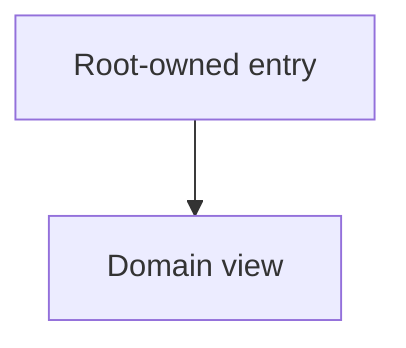

# [Product Name]: [Domain Name] UI Structure Detail

**Domain key**: [stable-domain-key]
**Parent UI root**: [Relative link to canonical UI structure root]
**Bundle row**: [Link to this member's row in the root]

This member owns domain-level navigation, screen/view inventory, domain-only
patterns, and structural questions. The root owns global contexts, shell,
navigation, shared patterns, terminology, and bundle membership.

## Domain Navigation

## Screen or View Inventory

| Screen or view | Owning feature | Serves | Context |
|---|---|---|---|
| [Approved outcome] | F00X | PR-00X | [Approved context] |

## Domain-Only Patterns

| Pattern | Behavior | Source |
|---|---|---|
| [Pattern, or None] | [Requirement-backed behavior] | PR-### |

## Open Structural Questions

- [Unresolved domain structural question and decision owner]
