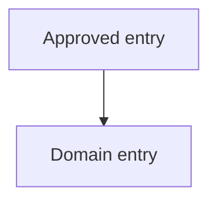

# [Product Name]: UI Structure

**Source Requirements**: [Relative link to approved product requirements]
**Source Roadmap**: [Relative link to approved feature roadmap]
**Status**: Ready for Review
**Artifact bundle**: split
**Last Updated**: YYYY-MM-DD

Human approval is recorded by the lifecycle owner after review; generation of
this draft does not approve it.

This root owns global interaction contexts, navigation, shared regions,
cross-domain patterns, terminology, and domain routing. Domain members own only
domain-level structure.

## Interaction Contexts

| Context | Users | Primary tasks | Constraints |
|---|---|---|---|
| [Approved device, channel, or interaction context] | [User group] | [Requirement-backed tasks] | [Cited constraints] |

## Global Experience Constraints

- **PR-###**: [Constraint and its structural consequence]

## Global Navigation and Shared Regions



```text
+--------------------------------------------------+
| {{ optional persistent region }}                 |
+--------------------------------------------------+
| {{ domain content region }}                      |
+--------------------------------------------------+
| {{ optional action or status region }}           |
+--------------------------------------------------+
```

| Region | Presence | Purpose | Source |
|---|---|---|---|
| [Region] | [Always or condition] | [Approved purpose] | PR-### |

## Domain Registry

| Domain key | Detail path | Roadmap features |
|---|---|---|
| [stable-domain-key] | `{{DOMAIN_1_PATH}}` | F001, F002 |

## Cross-Domain Patterns

| Pattern | Behavior | Source |
|---|---|---|
| [Shared pattern] | [Requirement-backed behavior] | PR-### |

## Terminology

| Concept | Approved UI label | Avoid |
|---|---|---|
| [Concept] | [Label] | [Ambiguous or deprecated term] |

## Open Structural Questions

- [Unresolved global structural question and decision owner]

## Member Registry

The complete set of domain-detail files owned by this root. List each member
exactly once; do not list this root or cited source artifacts. No hashes are
recorded — Git detects member drift.

| Path | Owns |
|---|---|
| `{{DOMAIN_1_PATH}}` | `{{DOMAIN_1_NAVIGATION_BRANCH}}` |
