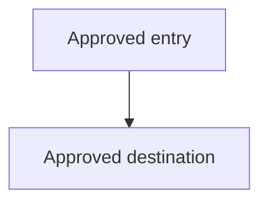

# [Product Name]: UI Structure

**Source Requirements**: [Relative link to approved product requirements]
**Source Roadmap**: [Relative link to approved feature roadmap]
**Status**: Ready for Review
**Artifact bundle**: single
**Last Updated**: YYYY-MM-DD

Human approval is recorded by the lifecycle owner after review; generation of
this draft does not approve it.

This document owns product-level UI structure: supported interaction contexts,
navigation, shared regions, screen inventory, and cross-screen behavior. It
does not own visual style or feature-level screen detail.

## Interaction Contexts

| Context | Users | Primary tasks | Constraints |
|---|---|---|---|
| [Approved device, channel, or interaction context] | [User group] | [Requirement-backed tasks] | [Cited constraints] |

## Global Experience Constraints

- **PR-###**: [Constraint and its structural consequence]

## Navigation Map



- [Requirement-backed navigation invariant]

## Shared Regions

```text
+--------------------------------------------------+
| {{ optional persistent region }}                 |
+--------------------------------------------------+
| {{ context-specific content region }}            |
+--------------------------------------------------+
| {{ optional action or status region }}           |
+--------------------------------------------------+
```

| Region | Presence | Purpose | Source |
|---|---|---|---|
| [Region] | [Always or condition] | [Approved purpose] | PR-### |

## Screen Inventory

| Screen or view | Owning feature | Serves | Context |
|---|---|---|---|
| [Approved outcome] | F00X | PR-00X | [Approved context] |

## Cross-Screen Patterns

| Pattern | Behavior | Source |
|---|---|---|
| [Shared pattern] | [Requirement-backed behavior] | PR-### |

## Terminology

| Concept | Approved UI label | Avoid |
|---|---|---|
| [Concept] | [Label] | [Ambiguous or deprecated term] |

## Open Structural Questions

- [Unresolved structural question and decision owner]
