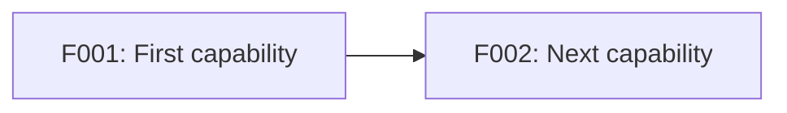

# [Product Name]: Feature Roadmap

**Source Requirements**: [Relative link to approved product requirements]
**Status**: Draft | Review | Approved
**Last Updated**: YYYY-MM-DD

## Delivery Strategy

[How the sequence reaches a usable MVP while controlling product risk.]

## Delivery Checklist

The checkbox means the feature has passed its independent acceptance, not merely
that its specification, plan, tasks, or implementation draft exists.

- [ ] **F001: [User Capability]** - Planned
- [ ] **F002: [Next User Capability]** - Blocked by F001

Allowed delivery statuses: `Proposed`, `Planned`, `Specified`, `In Progress`,
`Blocked`, `Ready for Acceptance`, `Done`, `Deferred`, `Cancelled`.

## Feature Dependency Map



## Feature Sequence

### F001: [User Capability]

- [ ] **Accepted and delivered**

**Delivery Status**: Proposed | Planned | Specified | In Progress | Blocked |
Ready for Acceptance | Done | Deferred | Cancelled
**Feature Spec**: Not created | [Relative link to feature spec]
**Completed On**: Not completed | YYYY-MM-DD
**Acceptance Evidence**: Not available | [Test report, release, demonstration, or approval reference]

**Outcome**: [What a user can accomplish after this feature]

**Scope**:

- [Included behavior]

**Non-Goals**:

- [Behavior deliberately left to another feature]

**Owns Requirements**: PR-001, PR-002
**Applicable Cross-Cutting Rules**: PR-100
**Dependencies**: None
**Release Boundary**: MVP | Post-MVP | Deferred
**Primary Risk**: [Product or delivery uncertainty]

**Independent Acceptance**:

[A short end-to-end demonstration that proves this feature delivers value.]

**Suggested Spec Kit Name**: `[short-action-noun-name]`

**Spec Kit Handoff**:

```text
Create a feature specification for F001 from [ROADMAP_PATH].
Use [PRODUCT_REQUIREMENTS_PATH] as the product source of truth.
Implement only F001 Scope, preserve its Non-Goals, and cover the listed PR IDs.
Do not absorb behavior assigned to later features.
```

## Parallel Work

- [Features that may proceed in parallel after named prerequisites]

## MVP Boundary

- [ ] **F001**: [MVP feature and current delivery status]
- [ ] **F002**: [MVP feature and current delivery status]
- **Deferred**: [Feature IDs and rationale]

## Requirements Coverage

| Requirement | Relationship | Feature(s) | Status | Notes |
|-------------|--------------|------------|--------|-------|
| PR-001 | Owns | F001 | Covered | |
| PR-100 | Applies | F001, F002 | Covered | Cross-cutting safeguard |

## Validation Findings

- **Uncovered requirements**: None
- **Duplicate ownership**: None
- **Circular dependencies**: None
- **Boundary concerns**: None