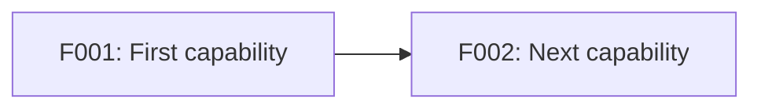

# [Product Name]: Feature Roadmap

**Source Requirements**: [Relative link to approved product requirements]
**Status**: Draft | Ready for Review | Approved
**Last Updated**: YYYY-MM-DD
**Approved By**: Not approved | [Name or role]
**Approval Evidence**: Not approved | [Explicit user statement or review reference]
**Profile sizing**: full | lite
**Sizing evidence**: [Feature, deployable, datastore, team, and constraint counts]

## Delivery Strategy

[How the sequence reaches a usable MVP while controlling product risk.]

## Lifecycle Boundary

This roadmap owns product outcome, horizon, sequence, dependencies, and release
boundary. It does not mirror mutable delivery state. Resolve the active item in
`.specify/flow-state.yaml` and historical verification, acceptance, or release
records by feature ID through `.specify/artifact-index.yaml`.

## Domain Registry

| Domain key | Detail path | Feature IDs | Requirement range |
|---|---|---|---|
| [stable-domain-key] | this file | F001 | PR-001..PR-010 |

## Feature Dependency Map


```mermaid
flowchart LR
    F001[F001: First capability] --> F002[F002: Next capability]
```

## Feature Sequence

### F001: [User Capability]
**Horizon**: Committed | Planned | Candidate | Unknown
**UI Surface**: none | reuses existing | new screens
**Product Domain**: [stable-domain-key]

**Outcome**: [What a user can accomplish after this feature]

**Scope**:

- [Included behavior]

**Non-Goals**:

- [Behavior deliberately left to another feature]

**Owns Requirements**: PR-001, PR-002
**Applicable Cross-Cutting Rules**: PR-100
**Dependencies**: None
**Release Boundary**: MVP | Post-MVP | Deferred
**Primary Risk**: [Product or delivery uncertainty]

**Independent Acceptance**:

[A short end-to-end demonstration that proves this feature delivers value.]

**Suggested Specification Name**: `[short-action-noun-name]`

**Feature Specification Handoff**:

```text
Create a feature specification for F001 from [ROADMAP_PATH].
Use [PRODUCT_REQUIREMENTS_PATH] as the product source of truth.
Implement only F001 Scope, preserve its Non-Goals, and cover the listed PR IDs.
Do not absorb behavior assigned to later features.
```

If `UI Surface` is not `none`, produce wireframes after clarification and before
technical planning only after the human explicitly authorizes that design step.
Resolve the eventual specification, wireframes, verification, and acceptance
records by `F001` through the generated artifact index; do not mirror their
mutable state here.

## Parallel Work

- [Features that may proceed in parallel after named prerequisites]

## MVP Boundary

- **F001**: [Why this outcome is required for MVP]
- **F002**: [Why this outcome is required for MVP]
- **Deferred**: [Feature IDs and rationale]

## Requirements Coverage

| Requirement | Relationship | Feature(s) | Status | Notes |
|-------------|--------------|------------|--------|-------|
| PR-001 | Owns | F001 | Covered | |
| PR-100 | Applies | F001, F002 | Covered | Cross-cutting safeguard |

## Validation Findings

- **Uncovered requirements**: None
- **Duplicate ownership**: None
- **Circular dependencies**: None
- **Boundary concerns**: None
