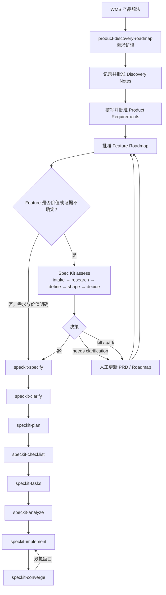
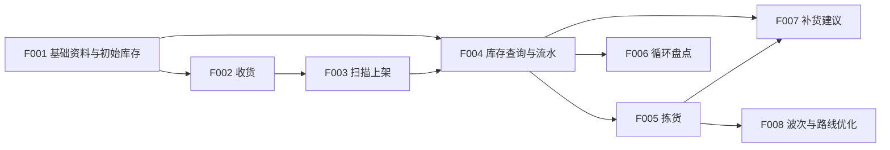

# Product Discovery、Assess 与 Spec Kit 工作流：WMS 示例

本文说明如何从一段口头产品想法开始，形成产品需求、Feature Roadmap，
对高风险想法进行可选评估，最后逐个 feature 进入 Spec Kit 的交付流程。

## 1. 三类工具的职责

| 工具                          | 核心问题                     | 主要产物                                 | 是否写代码            |
| --------------------------- | ------------------------ | ------------------------------------ | ---------------- |
| `product-discovery-roadmap` | 用户需要什么，产品应拆成哪些可交付能力      | Discovery Notes、产品需求、Feature Roadmap | 否                |
| Spec Kit `assess`           | 某个 idea 是否值得做，有没有足够证据    | idea 评估文件和 go/clarify/kill 决策        | 否                |
| Spec Kit 核心套件               | 已批准的 feature 要交付什么以及如何实现 | spec、plan、tasks 和代码                  | `implement` 阶段才写 |
|                             |                          |                                      |                  |

`product-discovery-roadmap` 可以替代 `batch-grill-me` 完成这条产品工作流。
如果只需要把一个问题问透，不需要 PRD、roadmap 或 Spec Kit handoff，
`batch-grill-me` 更轻量。

## 2. 推荐总流程



`assess` 是可选闸门，不是所有 feature 都必须经过。以下情况适合使用：

- 不确定客户是否真的有这个问题；
- 需要市场、用户或既有方案证据；
- feature 成本高，但价值尚未证明；
- 存在多个概念方案，需要先决定是否投入；
- 需要正式记录 go、needs-clarification 或 kill 决策。

纯基础能力且价值明确时，可以从 roadmap 直接进入 `speckit-specify`。

## 3. WMS 示例背景

一家中型仓库目前用纸张和 Excel 管理收货、上架、库存和拣货。仓库经理
希望建设 WMS，让操作员使用手持设备扫描条码，减少错放、错拣和库存差异。

最初口头需求可能只有：

> 我需要一个仓库管理系统，支持收货、上架、库存、拣货、盘点、补货、
> 波次和报表，最好还能优化拣货路线。

这段话不能直接交给一个 `/speckit.specify`，因为它包含多个可独立交付、
风险不同且具有依赖关系的产品能力。

## 4. 阶段一：Product Discovery 与 PRD

手动调用工作区 Skill：

```text
/product-discovery-roadmap

我们要建设一个供单仓库使用的 WMS。请从 Phase 1 开始访谈，
将每轮访谈记录到 doc/wms-discovery-notes.md，
将批准后的产品需求写入 doc/wms-product-requirements.md，
再将 roadmap 写入 doc/wms-feature-roadmap.md。
不要运行 Spec Kit。
```

Skill 会优先澄清会改变产品边界的决策，例如：

1. MVP 面向单仓库还是多仓库？
2. 操作员是否必须扫描库位码和商品码？
3. 系统是否拥有库存账，还是只向 ERP 回传执行结果？
4. 缺货、超收和破损由谁审批？
5. 断网时哪些仓内操作仍必须继续？

每轮回答后，Skill 先把原始问答、结论、理由、被否决方案和新的未决问题
追加到 `doc/wms-discovery-notes.md`。例如：

```markdown
### Round 2: 扫描与异常处理 - 2026-07-18

**Questions and Answers**

1. **Question**: 上架时必须扫描哪些条码？
  **Answer**: 必须先扫描商品，再扫描目标库位；两者不匹配时不得完成。

**Decisions and Rationale**

- **D-004**: MVP 强制扫描商品码和库位码，因为减少错放是核心结果。

**Rejected Alternatives**

- 允许手工选择库位：错误风险过高，不进入正常流程。

**Open Frontier**

- 条码损坏时是否允许主管授权例外？
```

后续答案推翻旧结论时，追加新的决定并将旧决定标记为 superseded，而不是
覆盖历史。所有访谈完成后，用户先批准 Discovery Notes；Skill 才将其中
已经收敛的结论提炼成 PRD。示例 PRD 可以包含：

```markdown
# WMS Product Requirements

## Product Requirements

- **PR-001**: 收货员 MUST 能够依据采购订单登记到货数量。
- **PR-002**: 系统 MUST 要求操作员扫描商品和目标库位后完成上架。
- **PR-003**: 仓库经理 MUST 能够查看每个商品在各库位的可用库存。
- **PR-004**: 拣货员 MUST 能够执行已释放订单的拣货任务。
- **PR-005**: 库存管理员 MUST 能够发起并完成循环盘点。
- **PR-006**: 系统 MUST 能够识别拣选位补货需求。

## Product Rules and Safeguards

- **PR-100**: 任何库存变更 MUST 保留操作者、时间、原因和前后数量。
- **PR-101**: 系统 MUST 阻止库存数量在未经授权的情况下变为负数。
```

这一步的输出是产品真相来源，不包含数据库、API、框架或类设计。

### UI 和交互设计放在哪一层？

不能简单地全部放在 PRD，也不能全部推迟到 `specify`。推荐按稳定性和
影响范围分层：

| 内容 | Discovery Notes | PRD | Feature Spec / Clarify | Plan / Design |
|------|-----------------|-----|------------------------|---------------|
| 用户当前怎么工作、痛点和原话 | 记录 | 提炼 | 引用必要部分 | 不放 |
| 关键用户旅程和必须完成的结果 | 形成证据 | 定义 | 展开为场景 | 实现 |
| 跨 feature 的交互原则 | 讨论过程 | 定义为 `PR-###` | 应用并验收 | 实现 |
| 设备环境、无障碍、确认和错误反馈要求 | 记录理由 | 定义约束 | 细化状态和边界 | 选择实现方式 |
| 页面、步骤、字段、状态和异常流 | 可记录候选想法 | 通常不固定 | 详细定义 | 设计实现 |
| 线框图、布局、组件和视觉样式 | 可链接研究素材 | 仅引用强制品牌规范 | 按需形成体验验收 | 详细设计 |
| 框架、组件库、API 和数据结构 | 不放 | 不放 | 不放实现细节 | 定义 |

WMS 的产品级体验要求可以写成：

```markdown
- **PR-050**: 手持设备上的高频仓内操作 MUST 能由戴手套的操作员完成。
- **PR-051**: 每次扫描后，系统 MUST 提供可区分的成功或失败反馈。
- **PR-052**: 会改变库存的异常处理 MUST 显示影响并要求授权确认。
```

到了 F003“扫描上架”的 `speckit-specify` 和 `speckit-clarify`，再定义具体
正常流、扫描顺序、加载态、重复扫描、错误条码、离线、取消和成功完成等
状态及验收场景。按钮放在哪里、使用什么组件和如何组织代码，则属于后续
设计与 `plan`，除非位置本身是经用户研究证明的强制产品约束。

## 5. 阶段二：Feature Roadmap

PRD 获得批准后，Skill 生成 `doc/wms-feature-roadmap.md`。示例拆分：

Roadmap 顶部使用 Feature Checklist 记录交付进度：

```markdown
## Delivery Checklist

- [x] **F001: 建立商品、库位和初始库存范围** - Done
- [x] **F002: 收货并登记到货** - Done
- [ ] **F003: 扫描上架** - Ready for Acceptance
- [ ] **F004: 查询库存与库存流水** - In Progress
- [ ] **F005: 释放并完成拣货任务** - Planned
- [ ] **F006: 循环盘点与差异审批** - Blocked by F004
- [ ] **F007: 生成补货建议** - Deferred
- [ ] **F008: 波次与路线优化** - Deferred
```

每个详细 Feature 条目同步记录状态和证据：

```markdown
### F002: 收货并登记到货

- [x] **Accepted and delivered**

**Delivery Status**: Done
**Feature Spec**: ../specs/002-wms-receiving/spec.md
**Completed On**: 2026-09-04
**Acceptance Evidence**: UAT-REC-02 passed; release v0.2.0
```

只有独立验收通过才勾选。创建了 `spec.md`、完成 `tasks.md`、代码已提交、
构建成功或部分测试通过，都只能推动状态，不能单独证明 Feature 已交付。
具体实现任务仍在各 Feature 的 `tasks.md` 中勾选，Roadmap 不复制任务清单。

示例 Feature 拆分如下：

| 顺序 | Feature | 用户结果 | 依赖 |
|------|---------|----------|------|
| F001 | 建立商品、库位和初始库存范围 | 经理能看到可运营的仓库基础资料 | 无 |
| F002 | 收货并登记到货 | 收货员能处理采购订单到货 | F001 |
| F003 | 扫描上架 | 操作员能把已收货库存放入有效库位 | F002 |
| F004 | 查询库存与库存流水 | 经理能解释当前数量及其变化原因 | F001、F003 |
| F005 | 释放并完成拣货任务 | 拣货员能完成订单拣货 | F004 |
| F006 | 循环盘点与差异审批 | 库存管理员能纠正受控库存差异 | F004 |
| F007 | 生成补货建议 | 经理能避免拣选位缺货 | F004、F005 |
| F008 | 波次与路线优化 | 经理能批量组织并优化拣货 | F005 |



假设 MVP 是 F001–F006。F007 和 F008 可以延期，其中 F008 的价值和
方案不确定性较高，适合先经过 `assess`。

## 6. 阶段三：可选的 Spec Kit Assess

安装扩展：

```powershell
specify extension add assess
```

针对 F008 单独运行：

```text
/speckit.assess.intake

评估 doc/wms-feature-roadmap.md 中的 F008 波次与路线优化。
slug=wms-wave-routing
```

然后按需执行：

```text
/speckit.assess.research slug=wms-wave-routing
/speckit.assess.define slug=wms-wave-routing
/speckit.assess.shape slug=wms-wave-routing
/speckit.assess.decide slug=wms-wave-routing
```

它会创建独立目录：

```text
.specify/
└── assessments/
    └── wms-wave-routing/
        ├── intake.md
        ├── research.md
        ├── problem.md
        ├── concept.md
        └── decision.md
```

各文件含义：

| 文件 | 内容 |
|------|------|
| `intake.md` | 原始 idea、来源和初始上下文 |
| `research.md` | 用户、市场、既有方案、支持与反对证据 |
| `problem.md` | 用户问题、目标、非目标、成功指标和不行动成本 |
| `concept.md` | 2–3 个概念方案、投入 appetite 和取舍 |
| `decision.md` | go、needs-clarification 或 kill，以及交接摘要 |

### Assess 是否修改 Roadmap？

不会。官方 `assess` 命令只写
`.specify/assessments/<slug>/`，不会修改：

- `doc/wms-product-requirements.md`；
- `doc/wms-feature-roadmap.md`；
- `specs/` 下的任何 feature；
- 源代码。

因此评估结束后需要人工接受决策并同步产品文档：

- **go**：保留 F008，引用 `decision.md`，然后进入 `speckit-specify`；
- **needs-clarification**：补充 PRD 或调整 F008 边界，再重新评估；
- **kill/park**：将 F008 标记为 Deferred/Rejected，并更新需求覆盖矩阵；
- **方案改变**：修改 roadmap 的 Scope、Non-Goals、依赖和验收方式。

不要让 `decision.md` 和 roadmap 长期表达不同结论。

## 7. 阶段四：逐个 Feature 进入 Spec Kit

F001 价值明确，可以不经过 `assess`，直接创建 feature spec：

```text
/speckit.specify

根据 doc/wms-feature-roadmap.md 中的 F001 创建 feature specification。
使用 doc/wms-product-requirements.md 作为产品需求来源。
只包含 F001 Scope，保留其 Non-Goals，覆盖 PR-001 以及适用于 F001
的跨切规则。不要吸收 F002 及后续 feature 的职责。
```

假设生成：

```text
specs/
└── 001-wms-inventory-foundation/
    ├── spec.md
    └── checklists/
        └── requirements.md
```

然后只针对 F001 运行完整交付链：

```text
/speckit.clarify
/speckit.plan
/speckit.checklist
/speckit.tasks
/speckit.analyze
/speckit.implement
/speckit.converge
```

完成并验收 F001 后，再为 F002 调用一次 `speckit-specify`。不要把整个
roadmap 一次性送入一个 feature spec。

## 8. 最终文件结构示例

```text
doc/
├── wms-discovery-notes.md
├── wms-product-requirements.md
└── wms-feature-roadmap.md

.specify/
├── memory/
│   └── constitution.md
└── assessments/
    └── wms-wave-routing/
        ├── intake.md
        ├── research.md
        ├── problem.md
        ├── concept.md
        └── decision.md

specs/
├── 001-wms-inventory-foundation/
│   ├── spec.md
│   ├── plan.md
│   ├── research.md
│   ├── data-model.md
│   ├── contracts/
│   ├── checklists/
│   └── tasks.md
├── 002-wms-receiving/
└── 003-wms-putaway/
```

三类目录分别代表：

- `doc/wms-discovery-notes.md`：访谈证据、决策理由与理解变化历史；
- `doc/wms-product-requirements.md`：获批且精炼的产品真相来源；
- `doc/wms-feature-roadmap.md`：整个产品的 feature 顺序与交付边界；
- `.specify/assessments/`：某个 idea 是否值得投入的决策证据；
- `specs/NNN-feature/`：某个已批准 feature 的正式交付工作包。

## 9. 何时使用 Batch Grill Me

`batch-grill-me` 与 `product-discovery-roadmap` 共享决策树访谈思想，但
终点不同：

| 对比项 | `batch-grill-me` | `product-discovery-roadmap` |
|--------|------------------|-----------------------------|
| 目标 | 达成共同理解 | 形成可交给 Spec Kit 的产品文档体系 |
| 提问方式 | 每轮询问当前 decision frontier | 同样按依赖分轮，每轮最多五题 |
| 默认文件产物 | 无固定产物 | PRD 和 Feature Roadmap |
| 需求 ID 与覆盖矩阵 | 不要求 | 强制 `PR-###` 追踪 |
| Feature 依赖和 MVP | 不要求 | 强制输出 |
| Spec Kit handoff | 不要求 | 每个 feature 必须提供 |
| 适用范围 | 任意设计、计划或决定 | 产品发现和 Spec Kit 前置拆分 |

推荐选择：

- 从模糊 WMS 想法一路形成 PRD 和 roadmap：只使用
  `product-discovery-roadmap`；
- 已有一个具体争议，只想彻底问清楚：使用 `batch-grill-me`；
- 产品价值本身缺少证据：在 roadmap 前评估整个产品 idea，或在 roadmap
  后对特定高风险 feature 使用 `assess`；
- 不要对同一范围先完整运行 `batch-grill-me`，再完整运行
  `product-discovery-roadmap`，否则会重复访谈。

## 10. 最简决策规则

```text
需求仍模糊，且需要 PRD + Feature Roadmap？
  → product-discovery-roadmap

只需要把一个决定问透？
  → batch-grill-me

不确定某个 idea 是否值得做？
  → speckit.assess.*

feature 已批准，准备进入交付？
  → speckit-specify → clarify → plan → checklist → tasks
    → analyze → implement → converge
```