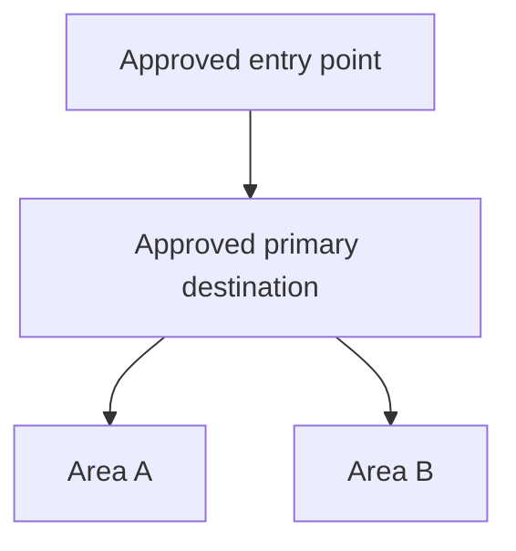

# [Product Name]: UI Structure

**Source Requirements**: [Relative link to approved product requirements]
**Source Roadmap**: [Relative link to approved feature roadmap]
**Status**: Ready for Review
**Last Updated**: YYYY-MM-DD

Human approval is recorded by the lifecycle owner after review; generation of
this draft does not approve it.

This document owns product-level UI structure: navigation, the global shell,
device contexts, and the screen inventory. It does not own individual feature
screens — those live in `specs/NNN-feature/wireframes.md`. It does not own
visual style.

## Device Contexts

| Context | Users | Primary tasks | Constraints |
|---------|-------|---------------|-------------|
| [Approved device or channel] | [User group] | [Requirement-backed tasks] | [Cited constraints] |

## Global Experience Constraints

Product requirements that every screen must honor:

- **PR-###**: [Constraint and what it forces on the shell]

## Navigation Map



Rules the map encodes:

- [Requirement-backed navigation invariant]

## Global Shell

```text
+--------------------------------------------------+
| [<]  {{ screen.title }}          [status area]   |
+--------------------------------------------------+
|                                                  |
|              {{ content region }}                |
|                                                  |
+--------------------------------------------------+
|              {{ action region }}                 |
+--------------------------------------------------+
```

| Region | Always present? | Contains | Notes |
|--------|-----------------|----------|-------|
| Header | [Yes/No] | [Approved global affordances] | [Requirement or rationale] |
| Content | Yes | Screen-specific | Scrolls |
| Action | [Yes/No] | [Approved action region] | [Context-specific behavior] |

### Shell variations by context

| Context | Variation | Reason |
|---------|-----------|--------|
| [Approved context] | [Shell variation] | [Cited reason] |

## Screen Inventory

| Screen | Owning feature | Serves | Context |
|--------|----------------|--------|---------|
| [Approved screen outcome] | F00X | PR-00X | [Approved context] |

Resolve any later feature wireframe by owning feature ID through the generated
artifact index; do not mirror its mutable status here.

## Cross-Screen Patterns

Patterns every feature reuses instead of reinventing. A feature that deviates
must state why in its own wireframes document.

| Pattern | Behavior | Mandated by |
|---------|----------|-------------|
| Input feedback | [Distinguishable success and failure signal after every submission] | PR-051 |
| Destructive confirmation | [Show impact, require explicit authorization] | PR-052 |
| Connectivity state, if required | [Requirement-backed behavior, or omit] | PR-0XX |

## Terminology

Labels used across screens. Must match the product requirements.

| Concept | UI label | Never call it |
|---------|----------|---------------|
| [Domain concept] | [Approved label] | [Deprecated synonym] |

## Open Structural Questions

- [Unresolved navigation or screen-inventory question and who must decide it]
